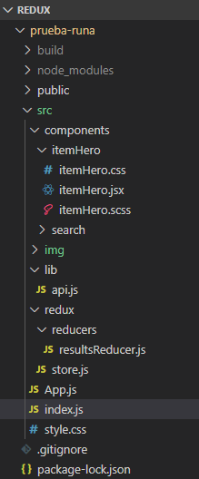

# Super Hero :muscle: :zap: :boom:

Después de ver algunas películas de Super Héroes en el cine, te preguntas: ¿De dónde salieron?, ¿Cuándo se crearon?, ¿Por qué puede volar?, o sea ... ¿Es un héroe o un villano? :hear_no_evil: Entonces vez en un puesto de revistas algunos ejemplares de Comics pero no sabes por donde empezar. En internet hay bastante información y te sientes agobiado para ser un principiante. Afortunadamente existe esta WebApp con todos los Héroes y Villanos del universo de comics, ¿No es genial?.

Descubre datos interesantes, como sus nombres reales, su primera aparición, poderes, etc. y vuelvete un experto. :smirk:

### Comenzando :rocket:

Para obtener una copia y probar en Desarrollo, haz 'Fork' :fork_and_knife: de este repositorio y descarga o clona desde tu terminal.

    git clone https://github.com/ivongarduno/React-Redux.git

### Requisitos :clipboard:

Solo necesitas un editor de código donde debes abrir la carpeta clonada en el paso anterior y la terminal. Ejecuta a continuación lo siguiente para instalar las dependencias necesarias. 

    npm install

### Instalación :computer:

Para ver el resultado en tu navegador

    npm start

Para desplegar el proyecto con un servidor como GitHub consulta la guía [Aquí](https://create-react-app.dev/docs/deployment/)

    npm run deploy

### Herramientas de contrucción :wrench:

Este proyecto fue desarrollado con ReactJS, Redux para almacenar el estado y el preprocesador de estilos Sass.

* [create-react-app](https://github.com/facebook/create-react-app)
* [Redux](https://es.redux.js.org/docs/basico/uso-con-react.html)
* [API SuperHero](https://www.superheroapi.com/)
* [Sass](https://sass-lang.com/)

### Árbol :deciduous_tree:

La estructura de las carpetas se ve así, y la decisión de organizarlas de esta manera fue para obtener un codigo más organizado y fácil de leer. Cada carpeta en components contiene un componente de React y su archivo de estilos independiente. En la carpeta lib podrás encontrar el archivo donde se ejecuta el consumo de la API. En la carpeta redux podrás encontrar el store y los reducers necesarios para el funcionamiento de la aplicación con esta librería y el archivo index.js es el punto de entrada.

### Siguientes alcances :construction:

Los siguientes alcances seran desarrollar otra vista donde puedas consultar de acuerdo a un filtro especifico para profundizar más en el uso de las herramientas aprendidas en este proyecto.

