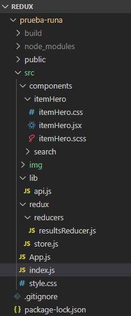

# Super Hero :muscle: :zap: :boom:

After watching some superhero movies in the cinema, you ask yourself: Where did they come from?, When were they created?, Because he can fly? ... Is he a Hero or a Villain? :hear_no_evil: Then, in a magazine stand, some copies of comics but you don´t know where to start. On the Internet there is enough information and you feel overwhelmed to be a beginner. Fortunately there is this webApp whit all the Heroes and villains of the comic universe, Isn´t great?.

Discover interesting facts, such as their real names, their first appearance, powers, etc. and become an expert. :smirk:

### Satarting :rocket:

To get a copy and test in development, 'Fork' :fork_and_knife: this repository and download or clone from your terminal.

    git clone https://github.com/ivongarduno/React-Redux.git

### Requirements :clipboard:

You need a code editor where you must open the cloned folder in the previous step and the terminal. Run below to install the dependencies. 

    npm install

### Installation :computer:

See the result in your browser.

    npm start

To deploy the project see the guide [Aquí](https://create-react-app.dev/docs/deployment/)

    npm run deploy

### Construction tools :wrench:

This project was developed whith ReactJS, redux to store the state and the preprocessor Sass

* [create-react-app](https://github.com/facebook/create-react-app)
* [Redux](https://es.redux.js.org/docs/basico/uso-con-react.html)
* [API SuperHero](https://www.superheroapi.com/)
* [Sass](https://sass-lang.com/)

### Tree :deciduous_tree:

The structure of the folders looks like this, the objective is to have an organized and easy to read code. Each folder in components contains a React component and its independent style file. In the lib folder you can find the file where the consumption of the API is executed. In the redux folder you can find the store and reducers necessary for the operation of the application.

### Next scopes :construction:

The following scopes will be to develop another view where yo can consult according to an specific filter.

